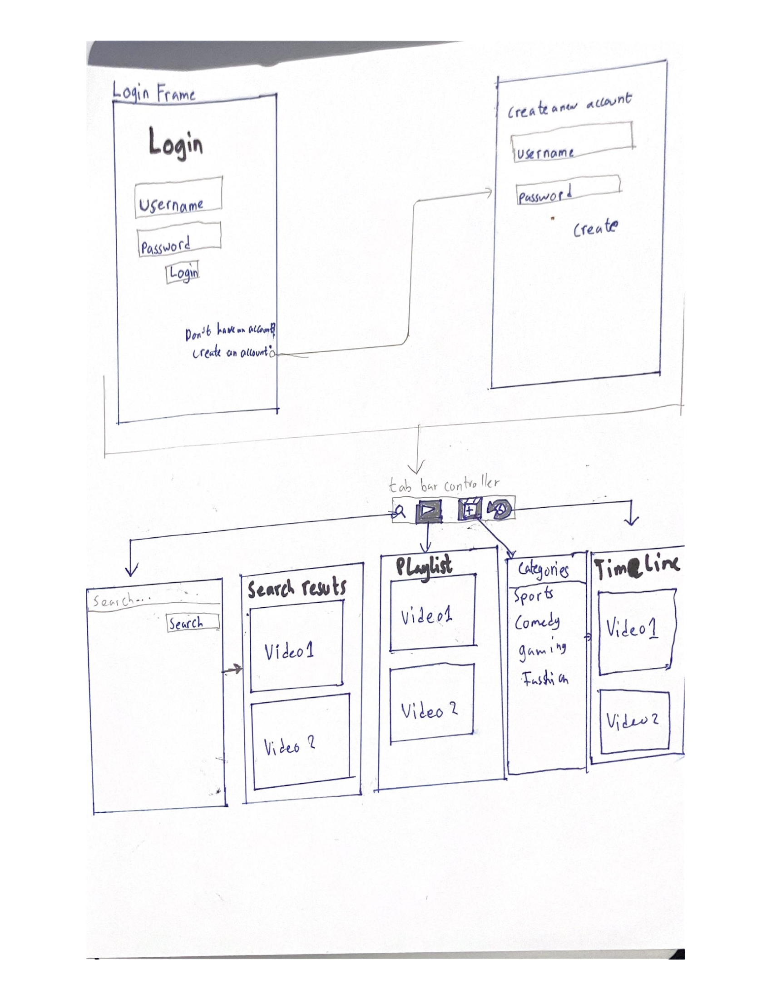

# Capstone
Original App Design Project - README Template

===

# APP_NAME_HERE

## Table of Contents
1. [Overview](#Overview)
1. [Product Spec](#Product-Spec)
1. [Wireframes](#Wireframes)
2. [Schema](#Schema)

## Overview
### Description
This application allows to  users to watch different videos posted by other users and based on their preference. 
### App Evaluation
[Evaluation of your app across the following attributes]
- **Category:** Social media
- **Mobile:** Users will be able to use it on android devices without restrictions in movement.
- **Market:** For individuals who want to relax and get entertained or engaged.
- **Habit:**User will be able to use this app in their leisure for entertainment and relaxation.
- **Scope:**Users would be able to watch videos based ont their preference and previous videos videos they've watched. 

## Product Spec

### 1. User Stories (Required and Optional)

**Required Must-have Stories**

* [fill in your required user stories here]
* Users must be able to login with an account
* Users must be able to choose their prefered type of video
* users must be able to watch videos on the app
* Users must be able to share videos
* Users must be able to log out of their account
* 
* 
* ...

**Optional Nice-to-have Stories**

* [fill in your required user stories here]
* auto-suggest videos based on the videos 
* suggest videos based on the user’s location
* users should be able to rate songs
* allow users to save videos in a playlist
* allow users to share playlists
* Handle playlist’s privacy so that everyone or only some people can see the playlist
* ...

### 2. Screen Archetypes

* [list first screen here]
* Login Screen
   * [list associated required story here]
   * Users must be able to login into their account
   * ...
* [list second screen here]
* Timeline
   * [list associated required story here]
   * auto-suggest videos based on the videos 

### 3. Navigation

**Tab Navigation** (Tab to Screen)

* [fill out your first tab]
* [fill out your second tab]
* [fill out your third tab]

**Flow Navigation** (Screen to Screen)

* [list first screen here]
* Login Screen
   * [list screen navigation here]
   * TImeline
* [list second screen here]
* TImeline
   * [list screen navigation here]
   * search
   * Playlist
   * categories

## Wireframes
[Add picture of[Login.pdf](your hand sketched wireframes in this section]

### [BONUS] Digital Wireframes & Mockups

### [BONUS] Interactive Prototype

## Schema 
[This section will be completed in Unit 9]
### Models
[Add table of models]
    Property	  Type	  Description
    objectId	  String	unique id for the user post (default field)
   ProfileImage	File	  profile image of current user
    VideoRating	Number	Rating of videos by users
    
    objectId	Pointer	pointer to the User
  RequestsTitle	String	Request's title
  Seearch	      String	      Search
CreatedAt	DateTime	Date when the request was created
### Networking
- [Add list of network requests by screen 
  Home Timeline
    Query
    Suggest vidoes
    watch videos
  Search
    Search
    
    Create Parse:
- 
- [Create basic snippets for each Parse network request]
- 
- [OPTIONAL: List endpoints if using existing API such as Yelp]
